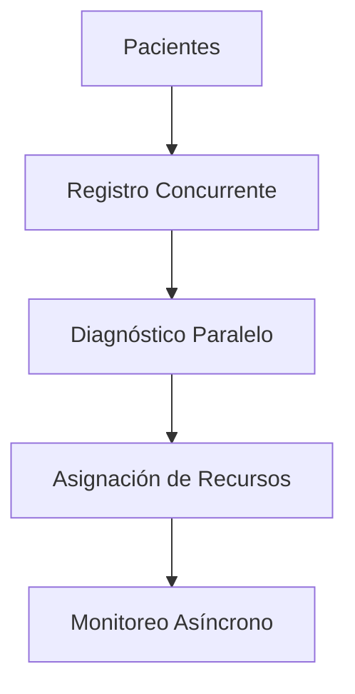

# 🏥 Sistema Hospitalario: Simulación con Programación Concurrente, Paralela y Asíncrona

**Autor:** Abraham Buenrostro Cruces  
**Materia:** Programación Paralela y Concurrente  
**Profesor:** Dr. Fuentes Cabrera José Gustavo  
**Lenguaje:** Python 3.12+  
**Licencia:** MIT

---
> ℹ️ **Actualización del README:**  
> Se actualizó este archivo tras una limpieza del repositorio, ya que algunos archivos fueron añadidos por error en carpetas del proyecto. Ahora la documentación refleja únicamente los módulos esenciales y funcionales del sistema.

## Descripción General

Este proyecto simula el funcionamiento de un sistema hospitalario utilizando paradigmas de programación concurrente, paralela y asíncrona para optimizar la gestión de pacientes, diagnósticos y recursos hospitalarios.

---

## Diagrama del Sistema



---

## Justificación de Paradigmas Utilizados

- **Concurrencia:** Utilizada en el módulo de registro (`hospital.py`) para permitir que múltiples pacientes se registren simultáneamente sin conflictos, empleando mecanismos como `threading.Lock` para evitar condiciones de carrera.

- **Paralelismo:** Implementado en `diagnostico.py` mediante el uso de `multiprocessing` para realizar diagnósticos médicos en paralelo, aprovechando múltiples núcleos del procesador y reduciendo el tiempo de espera.

- **Asincronía:** Aplicada en `simulacion.py` con `asyncio` para el monitoreo continuo de pacientes, permitiendo realizar otras tareas mientras se espera por eventos o respuestas, mejorando la eficiencia del sistema.

---

## Estructura del Proyecto

- `paciente.py`: Define la clase `Paciente` con atributos como nombre, síntomas y estado de salud.
- `hospital.py`: Gestiona el registro y almacenamiento de pacientes utilizando estructuras de datos seguras para concurrencia.
- `diagnostico.py`: Contiene funciones para realizar diagnósticos médicos en paralelo.
- `simulacion.py`: Coordina la simulación general del sistema, incluyendo el monitoreo asíncrono de pacientes.
- `configuracion.py`: Almacena parámetros de configuración del sistema.
- `reportes.py`: Genera reportes y estadísticas del sistema.
- `recursos/`: Carpeta que contiene recursos adicionales como imágenes o archivos de configuración.
- `reportes/`: Carpeta donde se almacenan los reportes generados por el sistema.

---

## Fragmentos Clave de Código

### Registro Concurrente de Pacientes (`hospital.py`)

```python
import threading

class Hospital:
    def __init__(self):
        self.pacientes = []
        self.lock = threading.Lock()

    def registrar_paciente(self, paciente):
        with self.lock:
            self.pacientes.append(paciente)
```

### Diagnóstico en Paralelo (`diagnostico.py`)

```python
from multiprocessing import Pool

def diagnosticar_paciente(paciente):
    # lógica de diagnóstico...
    return paciente

def diagnosticar_en_paralelo(pacientes):
    with Pool() as pool:
        return pool.map(diagnosticar_paciente, pacientes)
```

### Monitoreo Asíncrono (`simulacion.py`)

```python
import asyncio

async def monitorear(paciente):
    while paciente.estado != "estable":
        await asyncio.sleep(2)
        # lógica de monitoreo

async def iniciar_monitoreo(pacientes):
    await asyncio.gather(*(monitorear(p) for p in pacientes))
```

---

## Resultados y Rendimiento

Se realizaron pruebas con lotes de **20**, **10** y **15 pacientes**, observando el comportamiento del sistema bajo distintas cargas.

- **Registro Concurrente:** Todos los pacientes fueron registrados sin errores de concurrencia, demostrando la efectividad del uso de `threading.Lock`.

- **Diagnóstico Paralelo:** Con `multiprocessing`, el tiempo total de diagnóstico se redujo significativamente al aprovechar múltiples núcleos del procesador, incluso en pruebas con 20 pacientes.

- **Monitoreo Asíncrono con `asyncio`:** Se aplicó un sistema de monitoreo en el que algunos pacientes permanecen **en espera de recuperación**, sin bloquear el flujo de la simulación. Esto permitió manejar múltiples pacientes "en observación" de forma eficiente y no bloqueante.

- **Reportes Generados:** Para cada corrida, se generaron reportes automáticos que incluyen:
  - Total de pacientes registrados.
  - Diagnósticos asignados.
  - Recursos utilizados (camas, doctores).
  - Pacientes en espera y su evolución.

📂 Los reportes se encuentran en la carpeta `reportes/`, organizados con marcas de tiempo para facilitar su análisis posterior.

## 📦 Cómo Ejecutar el Proyecto

Sigue los siguientes pasos para clonar y ejecutar este sistema hospitalario en tu máquina local:

### 1. Clonar el Repositorio

```bash
git clone https://github.com/Abraham-Buenrostro-Cruces/Sistema_Hospitalario.git
cd Sistema_Hospitalario
```

### 2. Crear y Activar un Entorno Virtual (opcional pero recomendado)

```bash
python -m venv env
# En Windows:
env\Scripts\activate
# En macOS/Linux:
source env/bin/activate
```

### 3. Instalar Dependencias

Este proyecto no requiere librerías externas, pero asegúrate de tener Python 3.12+ instalado.

### 4. Ejecutar la Simulación

El punto de entrada principal es el archivo `simulacion.py`. Puedes ejecutarlo con:

```bash
python simulacion.py
```

Este script inicializará el sistema, generará pacientes aleatorios, aplicará diagnósticos y realizará monitoreo asíncrono. Los reportes generados aparecerán en la carpeta `reportes/`.


### 5. ⚙️ Configuración de la Simulación

El comportamiento del sistema puede personalizarse fácilmente a través del archivo `configuracion.py`. Este archivo define parámetros clave como el número de pacientes a generar, el número de camas disponibles y la cantidad de doctores asignados.

### ¿Cómo modificar la configuración?

Abre el archivo `configuracion.py` y edita los siguientes valores:

```python
# configuracion.py

NUM_PACIENTES = 20       # Número total de pacientes simulados
NUM_CAMAS = 10           # Camas disponibles en el hospital
NUM_DOCTORES = 5         # Doctores disponibles para diagnóstico
```

### 6. Ver Reportes Generados

Después de ejecutar el sistema, puedes abrir los archivos en la carpeta `reportes/` para revisar los resultados de la simulación.


